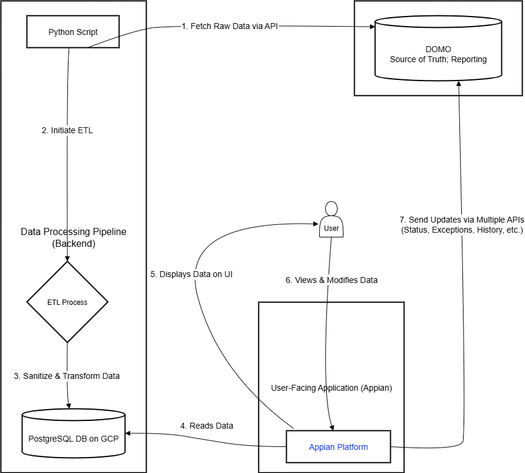

## 📦 Purpose

This is a fully automated, containerized data pipeline that:

- Fetches a dataset from the DOMO API  
- Downloads the CSV locally  
- Connects securely to a PostgreSQL Cloud SQL instance using Cloud SQL Proxy with IAM authentication  
- Inserts data into a staging table and runs a sequence of stored procedures  

---

## 🔁 High-Level Workflow

```
[Cloud Build Trigger]
        ↓
[Create a Docker Build and push it to Artifacts Registry]
        ↓
[Deploy to Cloud Run]
        ↓
[Deploy a Cloud Scheduler to trigger the Cloud Run]
        ↓
[Flask App on Startup]
        ↓
[Fetch CSV from DOMO]
        ↓
[Insert into Cloud SQL Staging Table]
        ↓
[Run DB Stored Procedures]
```

---

## 📁 Repository Structure

```
optra-master-data-loader/
│
├── Dockerfile.dockerfile     # Docker image with app and dependencies
├── cloudbuild.yaml           # Cloud Build pipeline for CI/CD
├── entrypoint.sh             # Entrypoint to launch proxy and app
├── handler.py                # Flask app definition
└── domo_loader.py            # Core ETL logic
```

---

## ⚙️ Components

### 🐳 Dockerfile

- Uses a lightweight `python:3.10-slim` image
- Installs system dependencies: `curl`, `unzip`, `jq`, `netcat`
- Installs Python packages: `Flask`, `Gunicorn`, `Requests`, `psycopg2-binary`
- Downloads and configures the **Cloud SQL Proxy (v2.10.0)**
- Sets up working directory and copies entrypoint script

### 🔐 entrypoint.sh

- Authenticates to Google Cloud via the **GCE metadata server**
- Launches the **Cloud SQL Proxy** with the service account access token
- Starts the Flask app using **Gunicorn**

### 🌐 handler.py

- A simple Flask app that forwards all HTTP requests to `main_fn()` in `domo_loader.py`

### 📥 domo_loader.py

- Handles:
  - Authentication to DOMO
  - Dataset download to `/tmp`
  - PostgreSQL DB connection via Cloud SQL Proxy
  - Data ingestion and stored procedure execution

---

## 🔐 Environment Variables

| Variable             | Description                                         |
|----------------------|-----------------------------------------------------|
| `DOMO_CLIENT_ID`     | DOMO API client ID                                  |
| `DOMO_CLIENT_SECRET` | DOMO API client secret                              |
| `DOMO_DATASET_ID`    | Dataset ID in DOMO to download                      |
| `CLOUD_SQL_INSTANCE` | GCP Cloud SQL instance (`project:region:instance`)  |
| `DB_NAME`            | PostgreSQL database name                            |
| `DB_USER`            | IAM-authenticated PostgreSQL user                   |
| `PORT`               | Port Flask app listens on (default: `8080`)         |

---

## Application Architecture diagram

